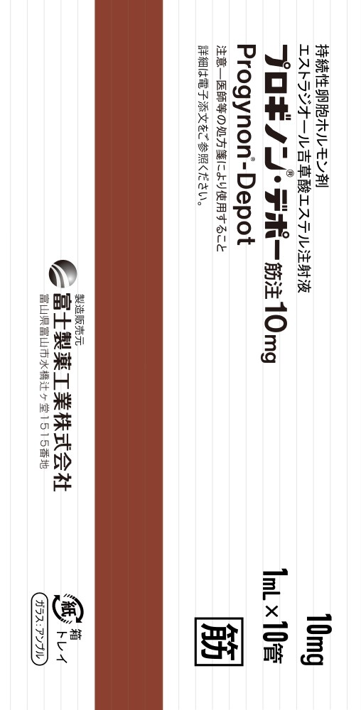

# Progynon-Depot 手机壳

| 手机壳                    | 效果图                          |
|:-------------------------:|:------------------------------:|
|  |  |

## 使用

在 [release](https://github.com/execute-darker/Archlinux-Phone-box/releases/latest) 页面下载 PNG 档案打印即可。

对于手机壳，由于各大电商平台有不同程度的图片压缩现象，其中拼多多最严重，淘宝较好，所以，建议在淘宝下单然后私聊客服直接发送 原图 png图片 即可。
 
十分欢迎您对本项目提出改进建议，提 issue 和 pr 均可（）。

## 介绍

这是一个用来包装 Progynon-Depot 安装介质的盒子的平面设计。

## LICENSE

本作品采用[知识共享署名-相同方式共享 3.0 未本地化版本许可协议](http://creativecommons.org/licenses/by-sa/3.0/)进行许可。
